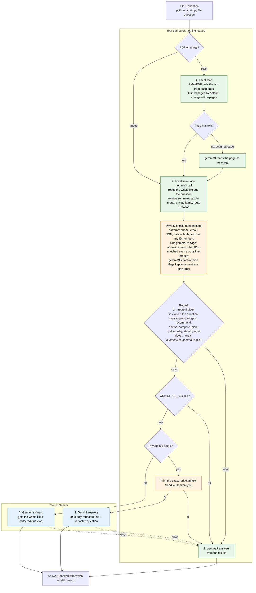

# How hybrid.py works

Green steps run on your computer, blue steps run in Google's cloud, and orange steps are the privacy gates.

## What can leave your computer

| Situation | Sent to Gemini |
|---|---|
| Route is local | Nothing |
| Route is cloud, nothing private found | The whole file + the question (with any private details in it redacted) |
| Route is cloud, private info found, you answer `y` | Only the redacted text + the redacted question. The file itself is never sent. |
| Route is cloud, private info found, you answer `n` | Nothing, gemma3 answers instead |
| No API key, or Gemini returns an error | Nothing more, gemma3 answers instead |

The route only decides *who answers*. Whether something is private is decided by the code, so a wrong route can't send a private file to the cloud.
